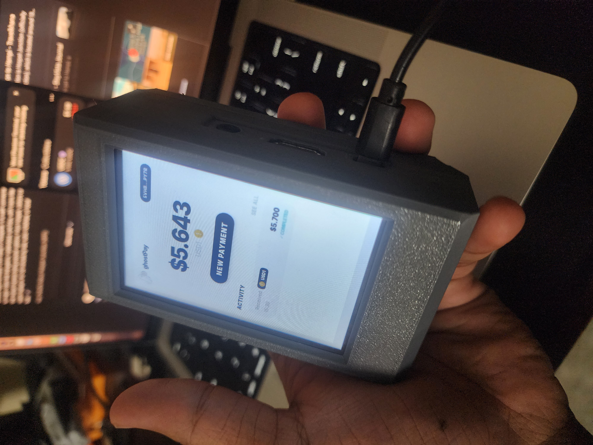
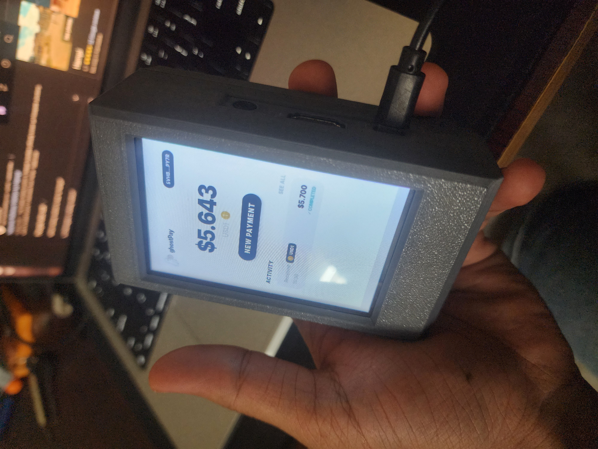

# ghostPay

**Private Payments on Solana**

ghostPay is a complete, privacy-first payment system built on Solana, consisting of two core components:

1. **Mobile Web Wallet** - A progressive web app that allows consumers to make private, everyday crypto payments
2. **Merchant Kiosk Terminal** - An open-source, hardware-based point-of-sale system designed for accepting confidential crypto payments

The merchant terminal is built using an inexpensive **Raspberry Pi**, a **3.5-inch touchscreen display**, a **custom 3D-printed enclosure**, and a **built-in speaker** for payment feedback.

All hardware designs and build instructions are publicly documented, making ghostPay the **first open-source hardware POS for private crypto spending on Solana**.

---

## Links

- **Live Demo**: [https://ghostpay-beta.vercel.app/](https://ghostpay-beta.vercel.app/)
- **Demo Video**: [https://youtu.be/Cf-JFnFbRhg](https://youtu.be/Cf-JFnFbRhg)

---

## Hardware




The ghostPay kiosk is built with accessible, open-source hardware:

- **Raspberry Pi 4/5** - Main computing unit
- **3.5" Touchscreen Display** (320x480 resolution) - User interface
- **3D-Printed Enclosure** - Custom designed case
- **Built-in Speaker** - Audio feedback for payment confirmations
- **Total Cost**: ~$80-120 USD

---

## Technology Stack

### Core Technologies

- **TypeScript** - End-to-end type safety across all applications
- **React 19** - UI framework for web wallet and kiosk interface
- **Electron 30** - Desktop application framework for kiosk terminal
- **Vite** - Lightning-fast development and build tool
- **Turborepo** - Monorepo build orchestration
- **pnpm** - Fast, disk space efficient package manager

### Blockchain & Privacy

#### Helius RPC
We use **Helius RPC** to provide reliable, low-latency Solana interactions, including:
- Real-time balance queries via `getParsedTokenAccountsByOwner()`
- Transaction polling every 3 seconds during active payment sessions
- SPL token account discovery for multi-token support
- Payment verification through reference ID matching

#### ShadowWire by RADR Labs
**ShadowWire** powers the privacy layer, enabling confidential payments through zero-knowledge proofs and privacy pools that hide transaction amounts and recipients.

**Complete Integration:**
- **Deposit** - Convert on-chain funds to privacy pool
- **Private Transfers** - Internal transfers with hidden amounts and recipients
- **Withdrawal** - Extract funds from privacy pool back to on-chain wallet
- **WASM Cryptography** - Browser-native zero-knowledge proof generation

### Database

- **better-sqlite3** - Embedded SQL database for offline transaction history
- **localStorage** - Browser-based transaction storage for web wallet

---

## Project Structure

```
ghostPay/
├── apps/
│   ├── web/              # Mobile web wallet (React + Vite)
│   ├── kiosk/            # Merchant POS terminal (Electron + React)
│   │   └── electron/     # Electron main process
│   │       ├── main.ts   # App lifecycle & kiosk mode
│   │       └── database.ts # SQLite transaction storage
│   └── ghostpay/         # Demo merchant dashboard with AI insights
├── packages/
│   ├── ui/               # Shared React components
│   ├── eslint-config/    # Shared ESLint configuration
│   └── typescript-config/ # Shared TypeScript configuration
├── docs/
│   └── images/           # README assets
└── turbo.json            # Turborepo configuration
```

---

## Features

### Mobile Web Wallet
- QR code payment scanning
- Private transfers via ShadowWire
- Deposit/withdraw between on-chain and privacy pool
- Real-time balance tracking (dual: private + public)
- Transaction history
- Multi-wallet support (Phantom, Solflare, Backpack)

### Merchant Kiosk Terminal
- Touchscreen point-of-sale interface
- QR code payment generation
- Real-time payment verification
- Audio feedback on payment completion
- Offline transaction history (SQLite)
- Kiosk mode for dedicated hardware
- 5-minute payment session timeout
- 3-second balance polling

### Privacy Features
- Zero-knowledge proofs for transaction privacy
- Hidden transaction amounts and recipients
- Privacy pool architecture with ShadowWire
- Reference ID system prevents transaction graph analysis
- No on-chain exposure of merchant revenue or customer spending

---

## Supported Tokens

For simplicity and a clean user experience, ghostPay currently supports a single stablecoin:

- **USD1** (USD1ttGY1N17NEEHLmELoaybftRBUSErhqYiQzvEmuB)

Multi-token support is planned for future releases.

---

## Technical Challenges

### Payment Verification
Listening to private transaction completion on the receiver side is non-trivial with privacy-preserving protocols.

**Solution**: We implemented a hybrid verification system that polls the ShadowWire API for balance changes when on-chain balance changes are detected on the sender address. This provides real-time confirmation without compromising privacy.

---

## Getting Started

### Prerequisites

- Node.js 18+
- pnpm 9.0.0+
- Raspberry Pi 4/5 (for kiosk hardware)

### Installation

```bash
# Clone the repository
git clone https://github.com/yourusername/ghostPay.git
cd ghostPay

# Install dependencies
pnpm install
```

### Development

```bash
# Run all apps in development mode
pnpm dev

# Run specific apps
pnpm dev:web      # Mobile web wallet
pnpm dev:kiosk    # Merchant kiosk terminal
```

### Building

```bash
# Build all apps
pnpm build

# Build specific apps
pnpm build:web    # Web wallet
pnpm build:kiosk  # Kiosk terminal (creates Electron installer)
```

### Environment Variables

Create `.env.local` files in each app directory:

#### Web Wallet (`apps/web/.env.local`)
```env
VITE_SOLANA_RPC_URL=https://mainnet.helius-rpc.com/?api-key=YOUR_KEY
VITE_REOWN_PROJECT_ID=YOUR_REOWN_PROJECT_ID
```

#### Kiosk (`apps/kiosk/.env.local`)
```env
VITE_MERCHANT_WALLET=YOUR_MERCHANT_WALLET_ADDRESS
VITE_SOLANA_RPC_URL=https://mainnet.helius-rpc.com/?api-key=YOUR_KEY
VITE_SKIP_ONBOARDING=false
```

---

## Kiosk Hardware Setup

For complete hardware setup instructions, see **[HARDWARE.md](HARDWARE.md)** - a comprehensive guide covering:

- Hardware requirements and parts list
- Raspberry Pi OS installation and configuration
- LCD driver installation (3.5" touchscreen)
- X Server and Openbox setup for kiosk mode
- Auto-start configuration
- Production deployment
- Troubleshooting common issues

### Quick Start

1. Install Raspberry Pi OS (64-bit)
2. Follow the complete setup guide in [HARDWARE.md](HARDWARE.md)
3. Clone and build ghostPay
4. Run in kiosk mode:

```bash
cd apps/kiosk
pnpm build
npm start -- --kiosk
```

### Kiosk Mode Features

- Fullscreen display (no window controls)
- Always-on-top window
- No menu bar
- Fixed 320x480 resolution
- Touch-optimized interface
- Auto-start on boot
- Offline transaction storage

---

## Roadmap

### 1. Public Launch
Release the mobile wallet and merchant kiosk for real-world usage, with clear documentation and installation guides for both users and merchants.

### 2. Hardware Enhancements
Upgrade the open-source kiosk hardware with:
- **NFC Support** - Tap-to-pay flows for faster checkout
- **Integrated Battery** - Portable, cable-free operation for cafés, events, and pop-up stores
- **Improved Enclosure** - Refined 3D-printed design with better cable management

### 3. Open-Source Maturity
- Polish codebase and improve developer documentation
- Publish detailed hardware build guides
- Create assembly tutorials and parts lists
- Welcome community contributions for new features, hardware variants, and ecosystem integrations

### 4. Feature Expansion
- Multi-token support (SOL, USDC, RADR, etc.)
- Multi-signature merchant accounts
- Recurring payment subscriptions
- Invoice generation and tracking
- Mobile native apps (iOS/Android)

---

## Architecture Highlights

### Privacy Architecture
- **WASM-based cryptography** - Native-speed zero-knowledge proofs in browser
- **Privacy pools** - Shared liquidity for enhanced anonymity sets
- **Reference ID system** - 128-bit random identifiers for payment tracking
- **Fee obfuscation** - Expected amounts calculated to detect transfers

### Payment Flow
1. Merchant generates payment request with unique reference ID
2. System creates Solana Payment Request QR code
3. Customer scans and sends payment via wallet
4. Kiosk polls ShadowWire balance every 3 seconds
5. Payment detected via balance change verification
6. 1.5-second confirmation delay
7. Transaction stored in local database
8. Audio feedback confirms completion

### Database Schema (Kiosk)
```sql
CREATE TABLE transactions (
  id TEXT PRIMARY KEY,              -- 128-bit reference ID
  amount REAL NOT NULL,             -- Payment amount
  currency TEXT DEFAULT 'USD',
  status TEXT CHECK(status IN ('pending', 'completed', 'failed')),
  timestamp TEXT NOT NULL,          -- ISO 8601 format
  customer_name TEXT,
  crypto_type TEXT NOT NULL,        -- Token symbol
  token_mint TEXT                   -- SPL token mint address
)
```

---

## Performance

- **QR Generation**: <10ms (local computation)
- **Payment Detection**: 3-second polling interval
- **Verification**: 1.5-second confirmation delay
- **Total Payment Time**: ~5-10 seconds (network dependent)
- **Database Query**: <5ms for 10,000+ transaction history
- **Helius RPC Latency**: <200ms for balance queries

---

## Contributing

ghostPay is actively maintained as an open-source project. We welcome contributions for:

- New features and improvements
- Hardware variants and designs
- Bug fixes and optimizations
- Documentation enhancements
- Ecosystem integrations

---

## License

MIT License - See [LICENSE](LICENSE) for details

---

## Acknowledgments

- **Helius** - Reliable Solana RPC infrastructure
- **RADR Labs** - ShadowWire privacy protocol
- **Solana Foundation** - Blockchain infrastructure
- **Reown** - Multi-wallet connection framework

---

## Contact & Support

- **Demo**: [https://ghostpay-beta.vercel.app/](https://ghostpay-beta.vercel.app/)
- **Video**: [https://youtu.be/Cf-JFnFbRhg](https://youtu.be/Cf-JFnFbRhg)
- **Issues**: GitHub Issues (coming soon)

---

Built with privacy, designed for merchants, open-source for everyone.
